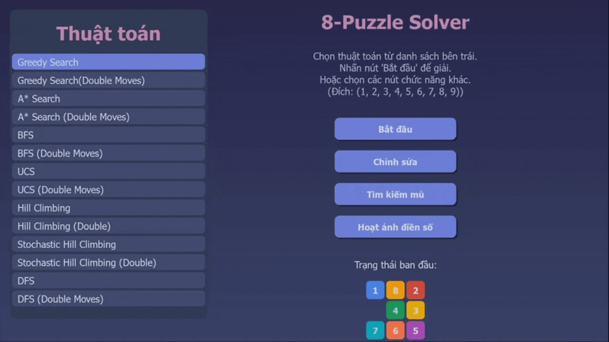
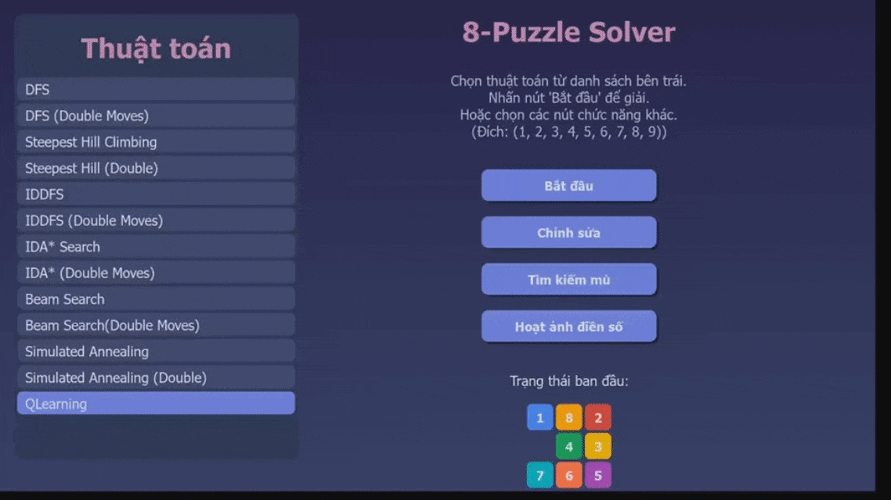
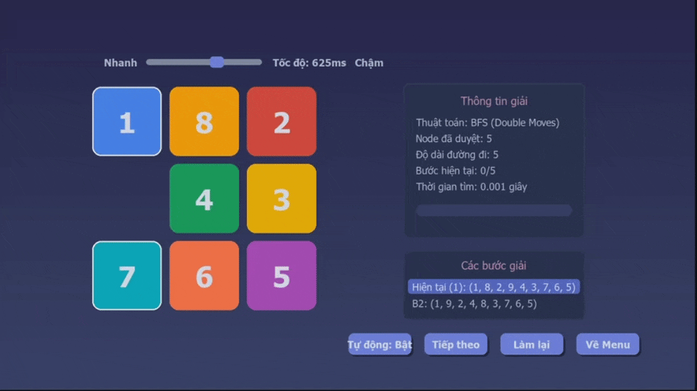
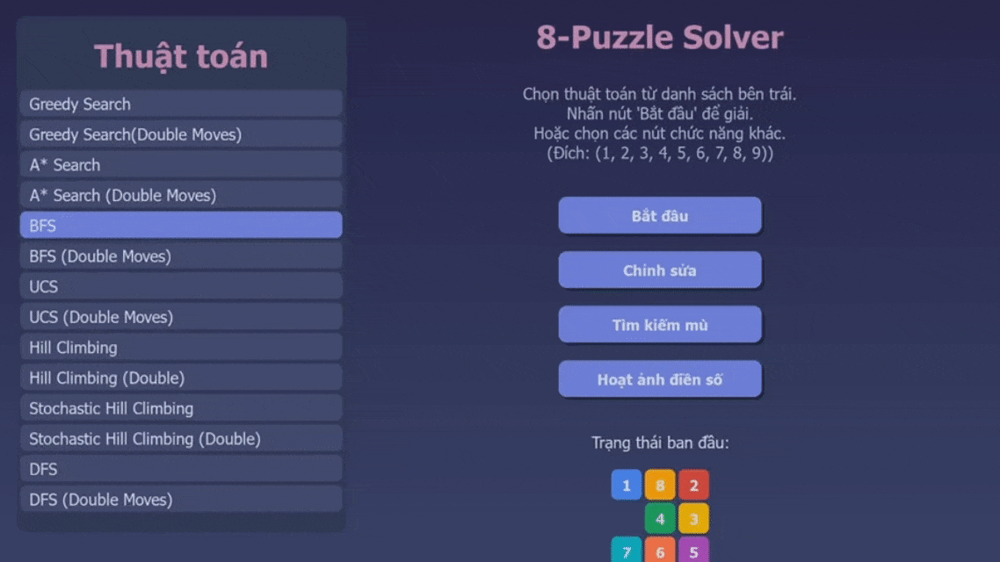

🧩 Khám Phá Thế Giới Thuật Toán Tìm Kiếm Cùng 8-Puzzle Trực Quan! 

🚀 Chào mừng bạn đến với dự án giải đố 8-Puzzle bằng Pygame! Hãy sẵn sàng để "nhìn thấy" cách cấc thuật toán suy nghĩ và tìm đường!
  
✨ Các tính năng của dự án:
   * Trải nghiệm Sống Động: Giao diện đồ họa Pygame trực quan, cho phép bạn dễ dàng tương tác và theo dõi từng bước giải.
   * Kho Tàng Thuật Toán: Khám phá một thư viện đa dạng các thuật toán tìm kiếm, được phân loại rõ ràng.
   * Thử Thách "Di Chuyển Kép": Nhiều thuật toán hỗ trợ chế độ "Double Moves", một ứng dụng thú vị của khái niệm And-Or Tree, cho phép ô trống di chuyển hai bước trong một lượt.
   * Xem Backtracking "Điền Số": Tính năng độc đáo mô phỏng thuật toán Backtracking điền các số vào lưới trống để đạt trạng thái đích, hiển thị cả bước thử và lui.
   * Đối Mặt "Tìm Kiếm Mù": Trải nghiệm tìm kiếm trong môi trường thông tin hạn chế, nơi agent phải duy trì "belief state" (trạng thái niềm tin) để tìm lời giải chung cho nhiều khả năng.
   * Làm Chủ Trạng Thái: Tùy chỉnh trạng thái ban đầu của puzzle theo ý muốn.
   * Hoạt Ảnh Mượt Mà: Theo dõi từng bước di chuyển của ô trống với tốc độ tùy chỉnh.
   * So Sánh Dễ Dàng: Chạy và quan sát hiệu quả của các thuật toán khác nhau trên cùng một bài toán.
     
🎬 Demo của dự án
   * Giao Diện Chính Thân Thiện: Chọn thuật toán, chỉnh sửa puzzle, hoặc khám phá các tính năng đặc biệt.
     
   * Theo Dõi Quá Trình Giải Đố: Puzzle, thông tin thuật toán, các bước giải, và nút điều khiển trực quan.
     
     
🌟 Các thuật toán được sử dụng trong chương trình

1. "Di Chuyển Kép" Thông Minh (Ứng Dụng And-Or Tree) 🔄
* Một số thuật toán cho phép ô trống thực hiện một hoặc hai bước di chuyển hợp lệ trong một lượt. Hãy tưởng tượng đây là một "nước đi đặc biệt"!
* Tại sao thú vị? Nó mô phỏng một ứng dụng của cây And-Or, nơi một "hành động lớn" (di chuyển kép) được tạo thành từ các hành động nhỏ hơn. Điều này có thể dẫn đến lộ trình ngắn hơn về số lượt, dù mỗi lượt kép có thể tốn "chi phí" cao hơn.

(Minh họa Beam Search với các bước di chuyển kép)
2. Tìm Kiếm Mù Trong Môi Trường Phức Tạp (Blind Belief Search) 🙈
* Điều gì xảy ra khi agent không chắc chắn về trạng thái thực tế của puzzle?
* Cách hoạt động: Agent duy trì một "belief state" (tập hợp các trạng thái có thể xảy ra) và cố gắng tìm một chuỗi hành động chung để đưa tất cả các trạng thái trong belief state đó về trạng thái đích.

(Hai puzzle (đại diện belief state) được giải đồng thời bằng một chuỗi hành động chung)
3. Hoạt Ảnh Điền Số Bằng Backtracking 🔢➡️✅
* Xem thuật toán Backtracking "vật lộn" để điền các số (1-9) vào một lưới 8-puzzle trống sao cho khớp với trạng thái đích cho trước.
* Trực quan hóa: Quan sát rõ ràng các bước "thử" và "lui" của thuật toán.

4. Tùy Chỉnh Puzzle Theo Ý Bạn ✍️
* Dễ dàng thay đổi vị trí các ô số để tạo ra bài toán 8-puzzle của riêng mình.

🔬 Các Thuật Toán Dưới Kính Hiển Vi
* Dự án triển khai một loạt các thuật toán, được chia thành các nhóm chính. Nhiều thuật toán có cả phiên bản chuẩn (di chuyển đơn) và phiên bản "Di Chuyển Kép" (đánh dấu (Double Moves) hoặc _ANDOR).
1. Tìm Kiếm Không Thông Tin (Uninformed/Blind Search)
* Tìm đường đi mà không cần "biết trước" nhiều về bản đồ.
   * Breadth-First Search (BFS): Duyệt rộng, tìm đường đi ngắn nhất (số bước).
   * BFS & BFS (Double Moves)
   * Depth-First Search (DFS): Duyệt sâu, có thể nhanh nhưng không tối ưu.
   * DFS & DFS (Double Moves)
   * Iterative Deepening DFS (IDDFS): Kết hợp BFS (tối ưu) và DFS (bộ nhớ).
   * IDDFS & IDDFS (Double Moves)
   * Uniform-Cost Search (UCS): Tìm đường đi chi phí thấp nhất (bước đơn chi phí 1, bước kép chi phí 2).
   * UCS & UCS (Double Moves)
2. Tìm Kiếm Có Thông Tin (Informed/Heuristic Search)
* Sử dụng "mẹo" (heuristic) để tìm đường thông minh hơn.
* Greedy Best-First Search: Luôn chọn hướng có vẻ "gần" đích nhất.
* Greedy Search & Greedy Search (Double Moves)
* A* Search: Cân bằng giữa chi phí đã đi và chi phí ước lượng còn lại (dùng heuristic Manhattan).
* A* Search & A* Search (Double Moves)
* Iterative Deepening A* (IDA*): Giống IDDFS nhưng dùng hàm đánh giá của A*.
* IDA* Search & IDA* (Double Moves)
3. Tìm Kiếm Cục Bộ (Local Search)
* Tập trung cải thiện giải pháp hiện tại thay vì tìm đường đi chi tiết.
* Hill Climbing: "Leo đồi" để tìm giải pháp tốt hơn.
* Simple Hill Climbing & Simple Hill Climbing (Double Moves)
* Steepest Ascent Hill Climbing (chọn láng giềng tốt nhất) & Steepest Ascent Hill Climbing (Double Moves)
* Stochastic Hill Climbing (chọn ngẫu nhiên trong các láng giềng tốt hơn) & Stochastic Hill Climbing (Double Moves)
* Local Beam Search: Giữ lại một vài trạng thái tốt nhất để khám phá song song.
* Beam Search & Beam Search (Double Moves)
* Simulated Annealing: Đôi khi chấp nhận bước đi tệ hơn để thoát "điểm kẹt" cục bộ.
* Simulated Annealing & Simulated Annealing (Double Moves)
4. Giải Quyết Vấn Đề Thỏa Mãn Ràng Buộc (CSP)
* Bài toán điền số được xem như một CSP.
* Backtracking Search: Được dùng trong "Hoạt ảnh Điền Số" (fill.py) để tìm cách điền số vào lưới thỏa mãn đích.
5. Tìm Kiếm Trong Môi Trường Phức Tạp
* Searching with No Observation (Blind Belief Search): Triển khai trong blind.py. Tìm chuỗi hành động chung cho một tập hợp các trạng thái có thể (belief state).
6. Học Tăng Cường (Reinforcement Learning)
* Agent học cách giải puzzle thông qua thử và sai.
Q-Learning: Agent xây dựng "bảng kiến thức" (Q-table) để biết hành động nào tốt ở mỗi trạng thái. Cần "huấn luyện" để học.

🛠️ Bắt Tay Vào Việc! Cài Đặt & Chạy
* Bạn cần có:
* Python 3.7+
* Pygame
  
Các bước đơn giản:

Lấy mã nguồn về:

* git clone https://github.com/Okarin2507/8_pieces_puzzle.git
* cd 8_pieces_puzzle

Cài đặt Pygame:
* pip install pygame
* Use code with caution.

Chạy chương trình:
* python main.py
* Use code with caution.

🎮 Hướng Dẫn Sử Dụng Nhanh
* Khởi chạy main.py.
* Chọn Thuật Toán: Từ danh sách bên trái trong menu chính.
* Bắt Đầu: Nhấn nút "Bắt đầu" để xem thuật toán giải puzzle (trạng thái ban đầu mặc định).
* Điều Khiển Hoạt Ảnh:
   * "Auto": Tự động chạy các bước.
   * "Tiếp theo": Xem từng bước một.
   * "Làm lại": Chạy lại thuật toán từ đầu.
   * Tốc Độ: Kéo thanh trượt để điều chỉnh tốc độ hoạt ảnh.
   * Chỉnh Sửa Puzzle: Nút "Chỉnh sửa trạng thái" cho phép bạn tạo puzzle của riêng mình.
   * Khám Phá Tính Năng Đặc Biệt:
   * "Tìm kiếm mù": Chạy demo Blind Belief Search.
   * "Hoạt ảnh điền số": Xem demo Backtracking điền số.
     
📂 Soi Cấu Trúc Dự Án
* algorithms/: Nơi chứa mã nguồn của các thuật toán.
* assets/: Hình ảnh và GIF demo cho README.
* blind.py: Logic cho tính năng Tìm Kiếm Mù.
* fill.py: Logic cho Hoạt Ảnh Điền Số bằng Backtracking.
* main.py: Điểm khởi đầu của ứng dụng.
* README.md: File readme của project
* .gitignore: Những thứ Git sẽ "lơ" đi.
  
👨‍💻 Về Tác Giả
* Dự án này được phát triển bởi Lê Ngô Nhựt Tân
* Email: lengonhuttan2005@gmail.com
* GitHub gốc của tác giả: https://github.com/Okarin2507
* Link dự án này: https://github.com/Okarin2507/8_pieces_puzzle
* Hy vọng bạn sẽ có những trải nghiệm thú vị và học hỏi được nhiều điều từ dự án này! 
